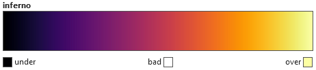
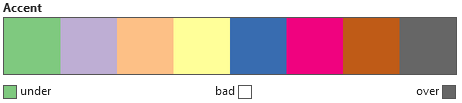
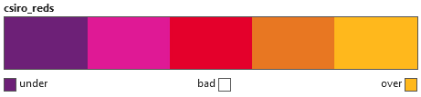
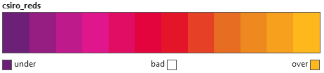
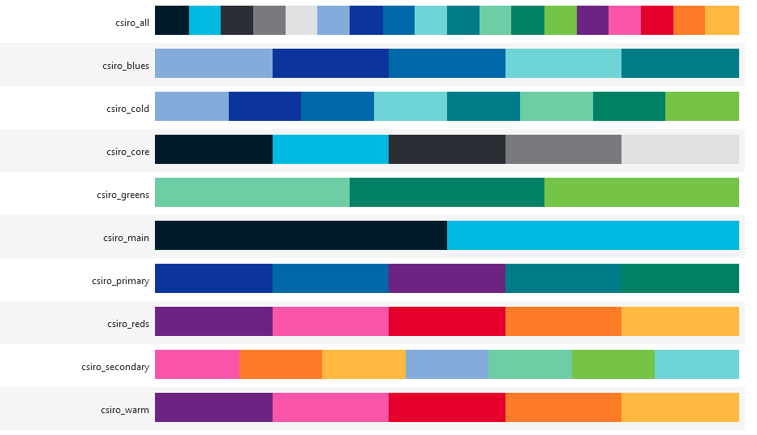
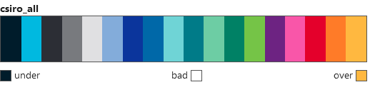
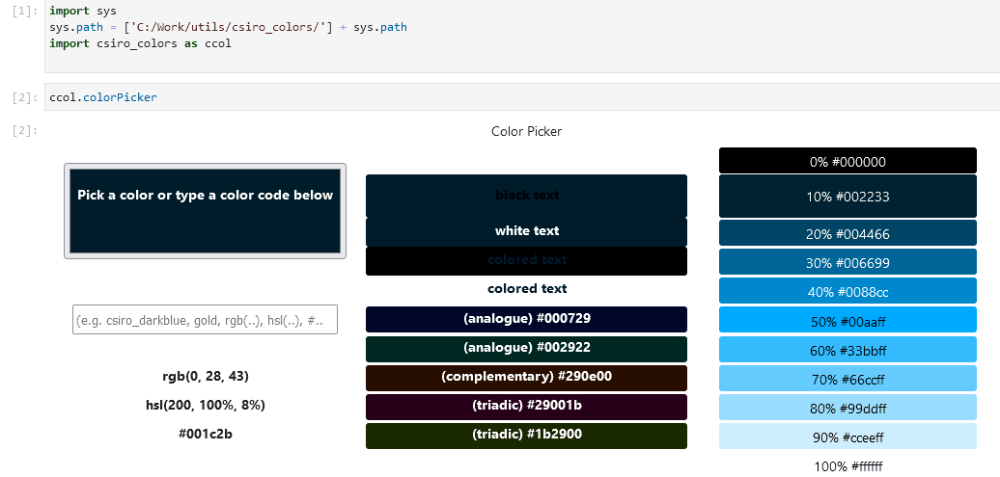

## Retrieving a colormap
This can be done by simply calling the **get_cmap** function.
This function will always return a **matplotlib** colormap

```Python
import csiro_colors as ccol
cmap = ccol.get_cmap('inferno') # this is a matplotlib colormap
cmap
```


```Python
cmap = ccol.get_cmap('Accent') # this is a colorbrewer colormap
cmap
```


```Python
cmap = ccol.get_cmap('csiro_reds') # this is a CSIRO specific colormap
cmap
```



## Modify a colormap
```Python
ccol.randomize_cmap(cmap) #we are not storing this result
```


```Python
cmap = ccol.generate_linear_cmap(cmap)
cmap
```


```Python
cmap = ccol.generate_discrete_cmap(cmap, n_colors=12)
# NOTE if you need more colors than the original ones you will have to convert the colormap to linear first
cmap
```



## One call to rule them all
```Python
cmap = ccol.brew_colors('csiro_reds', nbins=None) # retrieve it and return it untouched
cmap
```


```Python
cmap = ccol.brew_colors('csiro_reds', nbins=False) # retrieve it and return it as linear
cmap
```


```Python
cmap = ccol.brew_colors('csiro_reds', nbins=12) # retrieve it and return a specific number of colors
cmap
```


## Conversion to basic types
```Python
hex_colors = ccol.cmap_to_hex(cmap) #supports conversions between Colormap, hex codes or RGB/RGBA tuple
ccol.print_color(hex_colors)
```


```Python
rgb_colors = ccol.cmap_to_rgb(cmap, normalized=False)
ccol.print_color(rgb_colors)
```


## References

For a full list of **matplotlib**, **branca** or **CSIRO** colormaps, please refer to [matplotlib documentation](https://matplotlib.org/stable/gallery/color/colormap_reference.html), [R documentation](https://rdrr.io/cran/RColorBrewer/man/ColorBrewer.html)
or use:
```Python
ccol.csiro_registry
# or ccol.branca_registry
# or ccol.matplotlib_registry
```


Using the registry you can also select the wanted colormap
```Python
ccol.csiro_registry['csiro_all']
# or ccol.branca_registry['Spectral']
# or ccol.matplotlib_registry['inferno']
```


## Color Picker

This library also provides a handy HTML5 and CSS powered color picker to select and explore colors
```Python
ccol.colorPicker
```
